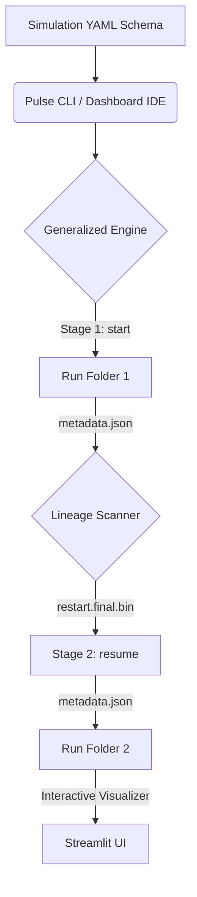

# ⚡ Pulse: Generalized Computational Simulation Orchestrator

Welcome to the definitive user handbook for **Pulse**, a premium, generalized, configuration-driven "no-code" simulation execution and lineage-tracking framework for **LAMMPS** (Large-scale Atomic/Molecular Massively Parallel Simulator).

---

## 📖 Introduction & Architecture

Pulse completely decouples physical simulation parameters and templates from execution logic. Instead of managing thousands of custom shell wrappers or hardcoded coordinate folders, you define the simulation as a state machine using a single **YAML Schema**.



---

## ⚙️ Environment Setup

Pulse reads key resource variables from a standard `.env` file at the root of the workspace.

```bash
# Path to your compiled LAMMPS executable
LAMMPS_EXECUTABLE=/home/guest/miniconda3/envs/gchain/bin/lmp

# Absolute path to where runs and catalogs are saved
DUMPING_YARD=/home/guest/palash/Granular-Chains-DEM-dev/dumping_yard

# HPC Cluster Commands
QSUB_PATH=qsub
QSTAT_PATH=qstat
```

---

## 🛠️ Writing Simulation Schemas (YAML Specifications)

A Pulse schema consists of a `simulation_type`, global parameters, and multiple execution nodes (stages).

### Example Schema Syntax:
```yaml
simulation_type: "Chain_Flop"
description: "A flexible chain mobility simulation"

global_params:
  dt: 1.0e-6
  viscosity: 0.025
  lepton_inc: "simulation_templates/lepton.inc"
  dump_inc: "simulation_templates/default_dump.inc.template"

stages:
  start:
    template_path: "simulation_templates/in.chain_flop.template"
    mode: "start"
    params:
      N: 4
      relax_steps: 5000000
    includes:
      lepton_inc: "{{lepton_inc}}"
      dump_inc: "{{dump_inc}}"
    outputs:
      restart_file: "restart/restart.final.bin"
      dump_files:
        - "chain/chain_*.dump"
      log_file: "lammps.log"

  resume:
    template_path: "simulation_templates/in.chain_flop_resume.template"
    mode: "resume"
    parent_stage: "start"
    params:
      relax_steps: 10000000
    includes:
      lepton_inc: "{{lepton_inc}}"
      dump_inc: "{{dump_inc}}"
    outputs:
      restart_file: "restart/restart.final.bin"
      dump_files:
        - "chain/chain_*.dump"
      log_file: "lammps.log"
```

---

## 🚀 Running Simulations

You can run your simulations either interactively using the visual wizard or automated via background terminal prompts.

### 1. Interactive Terminal Wizard
Run the wizard inside your shell. It will scan available schemas, list execution stages, prompt for parameter overrides on the fly, and run:
```bash
python main.py
# OR
python main.py interactive
```

### 2. Automated Run Command
Perfect for cron daemons or PBS batch cluster script files:
```bash
# Launch a new starting run
python main.py run_generalized --schema simulation_schemas/chain_flop.yaml --stage start --run-name MySimulationRun

# Resume/Branch the completed run
python main.py run_generalized --schema simulation_schemas/chain_flop.yaml --stage resume --parent-dir dumping_yard/Chain_Flop/MySimulationRun
```

### 3. Streamlit Visual IDE
Launch the Streamlit dashboard to visually inspect parameter list templates and build schemas interactively:
```bash
streamlit run Pulse/dashboard.py
```
Open **🛠️ Schema IDE** tab to:
- Select any template file and inspect its placeholder keys.
- Visually configure global parameters and stage definitions.
- Save schemas directly to your library with a single click.

---

## 🛡️ Pre-Flight Linter & Lints

Pulse includes a strict, automatic **Pre-flight Schema Linter** inside the `GeneralizedEngine`. Before LAMMPS begins execution:
1. It reads the target stage template script.
2. It parses all `{{ placeholder }}` tokens inside the template and matching target include templates.
3. It validates that every placeholder is bound by either a global parameter default, stage-specific override, or CLI override.
4. If a variable is missing, it cancels launch and prints a descriptive error:
   ```bash
   ❌ Schema Pre-Flight Linter Failed for Stage 'start':
     - Missing parameter 'N' required by input script template 'in.chain_flop.template'
   ```
This guarantees no silent failures or confusing LAMMPS runtime core-dumps!

---

## ❓ Troubleshooting & FAQs

> [!NOTE]
> Ensure your paths inside `.env` are absolute and executable permissions are granted (`chmod +x lmp`).

### 1. Why is the engine reporting "Could not locate restart binary file"?
- Make sure the parent stage has completed and written a `.bin` restart file inside its `restart/` folder.
- Ensure the parent run directory path provided to `--parent-dir` contains the `metadata.json` file.

### 2. How do I add standard includes to a new template?
- Use standard `{{ includes_<variable> }}` naming. When the engine renders the include file, it automatically registers the generated destination as a variable and passes it directly to LAMMPS.
- Example: An include target of `includes/setup.inc` will be accessible inside the template script as `{{includes_setup_inc}}`.
